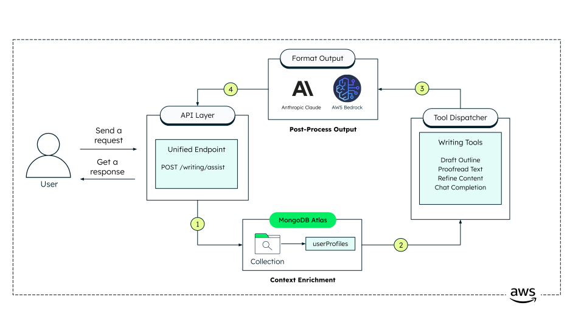

# **Content Lab - Writing Assistant**

This repository hosts the backend microservice for the Writing Assistant, an AI-powered tool designed to help users draft, refine, and improve their written content. The service uses large language models (such as Anthropic Claude via AWS Bedrock) to provide real-time writing suggestions, content completions, and productivity tools for writers, editors, and content creators.

## **High Level Architecture**



## **Architecture Overview**

This backend is structured as a modular microservice, focused on scalable, maintainable, and extensible AI-driven writing assistance. Each component is designed for independent development and integration with other services or frontends.

### **Core Structure**

#### 1. API Layer

- **File:** `backend/main.py`
- **Role:**
  - Serves as the main entrypoint for the backend service.
  - Exposes REST API endpoints for writing assistance, chat completions, and tool-based content operations.
  - Handles request routing and integrates with FastAPI for high-performance, async API handling.

#### 2. LLM Integration Layer

- **Directory:** `backend/bedrock/`
- **Key Files:**
  - `anthropic_chat_completions.py`: Handles chat completion requests to Anthropic Claude via AWS Bedrock, including prompt formatting and response parsing.
  - `client.py`: Manages the setup and secure communication with AWS Bedrock and Anthropic Claude, abstracting away authentication and API details.

#### 3. Writing Assistant Tools

- **Directory:** `backend/writing_assistant/`
- **Key Files:**
  - `assistant.py`: Orchestrates the workflow for writing assistance, including input validation, tool selection, and response aggregation.
  - `tools.py`: Provides specialized utility functions and tools for content editing, rewriting, grammar checking, and enhancement.

#### 4. Containerization & Deployment

- **Files:**
  - `Dockerfile.backend`: Defines the Docker image for the backend service.
  - `docker-compose.yml`: Orchestrates multi-container deployment (if needed).
  - `makefile`: Provides build and clean commands for Dockerized workflows.

#### 5. Configuration & Environment

- **Files:**
  - `.env` (to be placed in `/backend`): Stores environment variables for database, AWS, and service configuration.
  - `pyproject.toml`, `poetry.lock`: Manage Python dependencies and project metadata.

#### 6. Data Storage

- **Database:** MongoDB (Atlas)
- **Integration:**
  - Managed via environment variables and `pymongo` in the backend.
  - **Collections:** `news`, `reddit_posts`, `suggestions`, `drafts`, `userProfiles`.

#### 7. External Services

- **AWS Bedrock:**
  - Provides access to Anthropic Claude for LLM-powered completions and suggestions.
- **(Optional) Other APIs:**
  - The codebase is structured for easy extension to other AI or data services.

| Layer/Component   | Code Location(s)                                  | Responsibility                                             |
|-------------------|---------------------------------------------------|------------------------------------------------------------|
| API Layer         | `backend/main.py`                                 | Expose REST endpoints, route requests                      |
| LLM Integration   | `backend/bedrock/`                                | Communicate with AWS Bedrock & Anthropic Claude            |
| Writing Tools     | `backend/writing_assistant/`                      | Content editing, enhancement, workflow orchestration       |
| Containerization  | `Dockerfile.backend`, `docker-compose.yml`, `makefile` | Deployment, build, orchestration                           |
| Config & Env      | `.env`, `pyproject.toml`, `poetry.lock`           | Environment, secrets, dependencies                         |
| Data Storage      | MongoDB (Atlas), via `pymongo`                    | Store user data, drafts, suggestions, etc.                 |
| External Services | AWS Bedrock, Anthropic Claude                     | LLM completions, AI-powered suggestions                    |

## **Key Features**

- Real-time AI-powered writing suggestions and completions

- Modular toolset for content editing, rewriting, and enhancement

- Integration with Anthropic Claude and AWS Bedrock for advanced language capabilities

- API endpoints for seamless frontend integration

- Scalable, containerized deployment with Docker


## **Writing Assistant Workflow**

### Overview

1. **User Input:**  

Users submit a writing prompt, draft, or editing request via the frontend interface.

2. **Request Handling:**

The backend receives the request and routes it to the appropriate writing assistant tool or AI model.

3. **AI Processing:**

The service interacts with Anthropic Claude (via AWS Bedrock) to generate completions, suggestions, or edits based on the user’s input.

4. **Tool-Based Enhancement:**

Additional tools may process the AI output for grammar checking, style improvement, or formatting.

5. **Response Delivery:**

The content or suggestions are then returned to the user through the API.

**In summary:**  

The Writing Assistant backend combines user input, advanced AI models, and specialized tools to deliver high-quality writing assistance in real time.

## **Tech Stack**

### Web Framework & API

- [**fastapi**](https://fastapi.tiangolo.com/) for API development and building REST endpoints.
- [**uvicorn**](https://www.uvicorn.org/) for running the ASGI server.

### Database & Data Storage
- [**pymongo**](https://pymongo.readthedocs.io/) for MongoDB connectivity and operations.

### AWS & Cloud Services
- [**boto3**](https://boto3.amazonaws.com/v1/documentation/api/latest/index.html) for AWS SDK integration and Bedrock API access.
- [**botocore**](https://botocore.amazonaws.com/v1/documentation/api/latest/index.html) for low-level AWS service operations.
- [**Anthropic Claude**](https://aws.amazon.com/bedrock/anthropic/?ams%23interactive-card-vertical%23pattern-data--1838624787.filter=%257B%2522filters%2522%253A%255B%255D%257D) via AWS Bedrock for text generation and content analysis.

### Containerization & Deployment

- [**Docker**](https://www.docker.com/) for containerized deployment.
- docker-compose for multi-service orchestration.

### Data Processing & Utilities
- [**python-dotenv**](https://python-dotenv.readthedocs.io/) for environment variable management.


## **Relevant Models**

- [**Claude 3 Haiku**](https://docs.aws.amazon.com/bedrock/latest/userguidebedrock-runtime_example_bedrock-runtime_InvokeModel_AnthropicClaude_section.html) for writing assisant. 


## **Key Components**

#### a. Bedrock Integration (`backend/bedrock/`)

- **anthropic_chat_completions.py:**  
  Handles chat completion requests to Anthropic Claude via AWS Bedrock.

- **client.py:**  
  Manages API client setup and secure communication with external AI services.

#### b. Writing Assistant Tools (`backend/writing_assistant/`)

- **assistant.py:**  
  Core logic for orchestrating writing assistance workflows.

- **tools.py:**  
  Utility functions and specialized tools for content editing and enhancement.

#### c. API Entrypoint (`backend/main.py`)

- Serves as the main API gateway, routing requests to the appropriate modules and tools.


## **Prerequisites**

Before you begin, ensure you have met the following requirements:

- **MongoDB Atlas** account - [Register Here](https://account.mongodb.com/account/register)
- **Python 3.10 or higher**
- **Poetry** – [Install Here](https://python-poetry.org/docs/#installation)
- **AWS CLI** configured with appropriate credentials – [Installation Guide](https://docs.aws.amazon.com/cli/latest/userguide/getting-started-install.html)
- **AWS Account** with Bedrock access enabled – [Sign up Here](https://aws.amazon.com/bedrock/)
- **Docker** (optional, for containerized deployment) – [Install Here](https://docs.docker.com/get-docker/)

---


## **Setup Instructions**

### Step 1: Set Up the Repository and MongoDB Database

1. **Fork the Repository**  
   - Visit the [GitHub repository page](https://github.com/mongodb-industry-solutions/ist-media-internship-be2) and click the **Fork** button in the top right corner to create your own copy of the repository under your GitHub account.

2. **Clone Your Fork**  
   - Open your terminal and run:
     ```bash
     git clone https://github.com/<your-username>/ist-media-internship-be2.git
     cd ist-media-internship-be
     ```

3. **(Optional) Set Up Upstream Remote**  
   - To keep your fork up to date with the original repository, add the upstream remote:
     ```bash
     git remote add upstream https://github.com/<original-owner>/ist-media-internship-be2.git
     ```

### Step 2: Add MongoDB User

Follow [MongoDB's guide](https://www.mongodb.com/docs/atlas/security-add-mongodb-users/) to create a user with **readWrite** access to the `contentlab` database.

### 3. **Set Up Environment Variables**

> [!IMPORTANT]
> Create a `.env` file in the `/backend` directory with the following content:
>
> ```bash
>MONGODB_URI=your_mongod_uri
>DATABASE_NAME=dbname
>APP_NAME=appname
>USER_PROFILES_COLLECTION=userProfiles
>DRAFTS_COLLECTION=drafts
>AWS_REGION=regionname
> ```

## **Running the Backend**

### Virtual Environment Setup with Poetry

1. Open a terminal in the project root directory.
2. Run the following commands:
   ```bash
   make poetry_start
   make poetry_install
   ```
3. Verify that the `.venv` folder has been generated within the `/backend` directory.

---

### Start the Backend

To start the backend service, run:

```bash
poetry run uvicorn main:app --host 0.0.0.0 --port 8001
```

> Default port is `8001` for this microservice. Modify the `--port` flag if needed.

---

## Running with Docker

Run the following command in the root directory:

```bash
make build
```

To remove the container and image:

```bash
make clean
```

---

## API Documentation

You can access the API documentation by visiting the following URL:


```
http://localhost:<PORT_NUMBER>/docs
```
E.g. `http://localhost:8001/docs`


> [!NOTE]
> Make sure to replace `<PORT_NUMBER>` with the port number you are using and ensure the backend is running.

---

## Common errors

> [!IMPORTANT]
> Check that you've created an `.env` file that contains the required environment variables.